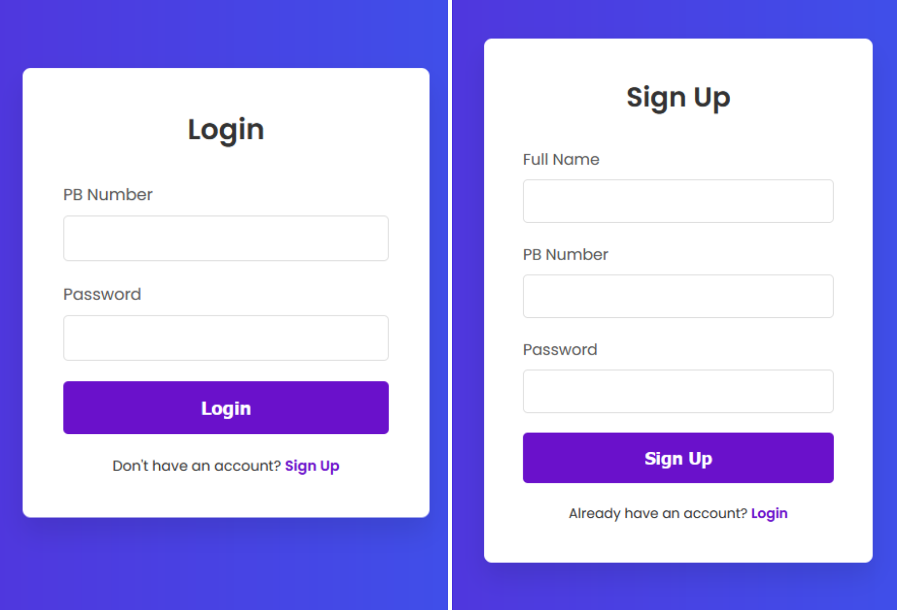
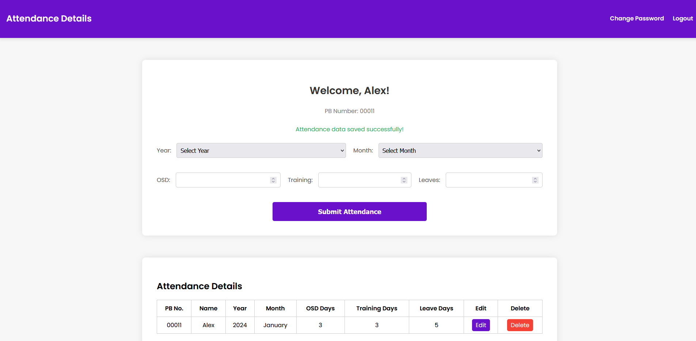
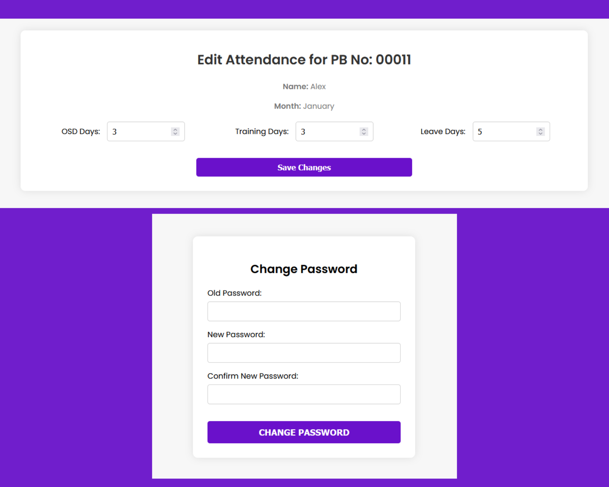

# Employee Attendance Management System

## Overview
This project is a comprehensive Employee Attendance Management System developed using PHP, HTML, CSS, MySQL, and XAMPP. It allows employees to manage their attendance records effectively with features such as account creation, attendance tracking, and secure password management.

## Installation Instructions

Follow these steps to set up the project on your local machine:

### Step 1: Install XAMPP
1. Download and install XAMPP from [Apache Friends](https://www.apachefriends.org/index.html).
2. Open the XAMPP Control Panel.
3. Start both **Apache Server** and **MySQL Server**.

### Step 2: Set Up the Project
1. Locate the `Projetct_A` folder from this repository.
2. Copy the `Projetct_A` folder.
3. Navigate to `C:\xampp\htdocs` and paste the `Projetct_A` folder there.
4. Before pasting, delete all existing files in the `htdocs` directory to avoid conflicts.

### Step 3: Configure the Database
1. Open a web browser and go to [http://localhost/phpmyadmin](http://localhost/phpmyadmin).
2. In phpMyAdmin, create a new database named `emp`.

### Step 4: Create Database Tables
1. Go to the **SQL** tab in phpMyAdmin.
2. Paste the following SQL queries into the query box and click **Go**:

    ```sql
    CREATE TABLE `emp`.`userdata` (
        `name` VARCHAR(30) NOT NULL,
        `PBno` VARCHAR(5) NOT NULL,
        `password` VARCHAR(100) NOT NULL,
        PRIMARY KEY (`PBno`)
    ) ENGINE = InnoDB;

    CREATE TABLE `emp`.`attendance_data` (
        `atid` VARCHAR(50),
        `PBno` VARCHAR(5) NOT NULL,
        `year` INT(4) NOT NULL,
        `month` CHAR(10) NOT NULL,
        `osdDate` FLOAT,
        `trainingDate` FLOAT,
        `leaves` FLOAT,
        PRIMARY KEY (`atid`),
        FOREIGN KEY (`PBno`) REFERENCES `emp`.`userdata`(`PBno`)
    ) ENGINE = InnoDB;
    ```

### Step 5: Access the Website
1. Open your web browser and navigate to [http://localhost/Projetct_A/login.php](http://localhost/Projetct_A/login.php) to start using the application.

## Features
- **Account Management**: Create and manage user accounts.
- **Attendance Tracking**: Enter, view, and manage attendance records including OSD days, leave days, and training days.
- **Password Management**: Securely change passwords.
- **User-Friendly Interface**: Simple and intuitive design for ease of use.
## Images
1. **Login Page and Sign Up Page**
   

2. **Attendance Dashboard**
   

3. **Password Change and Attendance edit Page**
   

## Contributions
Feel free to contribute to this project by opening issues or submitting pull requests. Your feedback and contributions are welcome!
